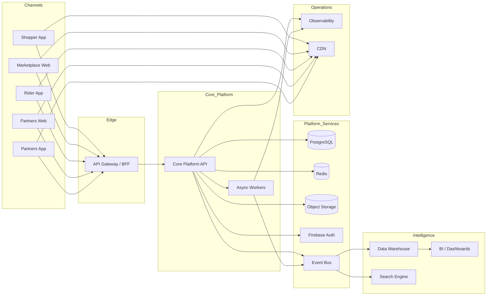

# MIJI Core Platform API

Backend service for the MIJI multi-tenant commerce and operations platform.

---

# Overview

The MIJI Core Platform API is the central backend service that powers the MIJI ecosystem.

It provides the operational and transactional capabilities required to manage organizations, stores, catalog data, pricing, inventory, orders, financial flows, customer communications, analytics, and platform-level infrastructure in a multi-tenant environment.

The platform is designed to support multiple client applications and operational surfaces, including:

- Shopper App
- Marketplace Web
- Rider App
- Partners Web (administration and POS)
- Partners App
- Internal operational tools
- Future ecosystem services
  
---

# Platform Domains

The backend is organized into several functional domains.

### Identity & Access
Authentication, users, memberships, roles, grants, invitations.

### Core Business
Tenants, stores, store configuration, fiscal settings, operational configuration.

### Commercial Master Data
Catalog structure, pricing foundations, customers, suppliers.

### Commercial Management
Promotions, campaigns, tagging, segmentation, marketing pushes.

### Operations
Inventory, stock movements, replenishment, orders, deliveries, POS operations, cash management, agent transactions.

### Financial
Payments, refunds, invoices, settlements, purchase flows, accounts payable.

### Communications
Chat systems, calls, privacy relay, support threads, communication templates.

### Analytics
Operational reporting, dashboards, alerts.

### Business Intelligence
Historical snapshots, ranking models, recommendation signals, forecast outputs, and performance intelligence artifacts.

### Platform (Cross-Cutting)
Audit logs, event infrastructure, idempotency control, notifications, file storage, observability.

---

# Architectural Perspective

The platform is described through three complementary views:

- Functional domains: what business capabilities the platform provides.
- System architecture: how the platform is deployed and integrated at a technical level.
- Project structure: how those capabilities are organized in the codebase.

---

# Target System Architecture


**Notes**
- PostgreSQL is used as the primary transactional database.
- Object Storage is used for product images, attachments, documents, and media assets.
- Firebase Auth is used as the identity provider for authentication.
- Redis supports caching, queues, and background job coordination.
- Event Bus supports asynchronous event-driven processing and downstream integrations.
  
This diagram represents the target platform architecture.  
The current implementation is progressively evolving toward this model.

---

# Tech Stack

| Layer | Technology |
| --- | --- |
| Backend Framework | NestJS |
| ORM | Prisma |
| Database | PostgreSQL (Supabase) |
| Authentication | Firebase Auth |
| Validation | class-validator |
| API Documentation | Swagger |
| Package Manager | pnpm |

---

# Target Project Structure

```
src/
├── modules/
│   ├── identity-access/
│   │   ├── auth/
│   │   ├── users/
│   │   ├── memberships/
│   │   ├── roles/
│   │   ├── grants/
│   │   └── invitations/
│   │
│   ├── core-business/
│   │   ├── tenants/
│   │   ├── stores/
│   │   ├── store-settings/
│   │   ├── fiscal-settings/
│   │   └── operational-settings/
│   │
│   ├── commercial-master-data/
│   │   ├── catalog/
│   │   ├── pricing/
│   │   ├── customers/
│   │   └── suppliers/
│   │
│   ├── commercial-management/
│   │   ├── promotions/
│   │   ├── campaigns/
│   │   ├── product-tagging/
│   │   ├── customer-tagging/
│   │   ├── segmentation/
│   │   └── push-campaigns/
│   │
│   ├── operations/
│   │   ├── inventory/
│   │   ├── stock-movements/
│   │   ├── replenishment/
│   │   ├── orders/
│   │   ├── deliveries/
│   │   ├── pos/
│   │   ├── cash-boxes/
│   │   └── agent-transactions/
│   │
│   ├── financial/
│   │   ├── payments/
│   │   ├── refunds/
│   │   ├── invoices/
│   │   ├── settlements/
│   │   ├── purchases/
│   │   └── accounts-payable/
│   │
│   ├── communications/
│   │   ├── conversations/
│   │   ├── calls/
│   │   ├── privacy-relay/
│   │   ├── support-threads/
│   │   └── templates/
│   │
│   ├── analytics/
│   │   ├── reporting/
│   │   ├── dashboards/
│   │   └── alerts/
│   │
│   ├── business-intelligence/
│   │   ├── segmentation-snapshots/
│   │   ├── product-behavior-snapshots/
│   │   ├── ranking-scores/
│   │   ├── recommendation-signals/
│   │   ├── forecast-snapshots/
│   │   └── campaign-performance-snapshots/
│   │
│   └── platform/
│       ├── audit/
│       ├── events/
│       ├── idempotency/
│       ├── notifications/
│       ├── files/
│       └── observability/
│
├── prisma/
│   ├── schema.prisma
│   └── migrations/
│
├── common/
│   ├── guards/
│   ├── interceptors/
│   ├── filters/
│   ├── decorators/
│   ├── pipes/
│   └── utils/
│
├── config/
├── integrations/
└── main.ts
```

Example internal structure for a domain module:

```
src/modules/operations/orders/
├── orders.controller.ts
├── orders.service.ts
├── orders.repository.ts
├── orders.module.ts
├── dto/
│   ├── create-order.dto.ts
│   ├── update-order.dto.ts
│   └── query-orders.dto.ts
├── responses/
│   ├── order.response.ts
│   └── order-summary.response.ts
├── events/
│   ├── order-created.event.ts
│   └── order-cancelled.event.ts
└── policies/
    └── order-access.policy.ts
```

---

# API Surface

Endpoints are organized by domain and exposed through REST APIs.

Examples:

```http
POST /v1/auth/exchange
GET  /v1/auth/me

GET  /v1/catalog/products
POST /v1/catalog/products
PATCH /v1/catalog/products/{id}

POST /v1/orders
GET  /v1/orders/{id}

POST /v1/payments
GET  /v1/support/threads/{id}
```

Full API documentation is available via Swagger at:

```text
/docs
```

---

# Environment Variables

Create a local environment configuration file.

```bash
cp .env.example .env
```

Example configuration:

```env
NODE_ENV=development
PORT=4000

DATABASE_URL="postgresql://..."
DIRECT_URL="postgresql://..."
SHADOW_DATABASE_URL="postgresql://..."

APP_NAME="MIJI-Core-Platform-API"
APP_VERSION=1.0.0

GOOGLE_APPLICATION_CREDENTIALS="/path/to/firebase-service-account.json"
FIREBASE_PROJECT_ID="your-firebase-project-id"

SUPABASE_URL="https://your-project.supabase.co"
SUPABASE_SERVICE_ROLE_KEY="your-service-role-key"
SUPABASE_BUCKET="items"

SEED_MODE=dummy
TENANT_CODE="miji-dev"
IMAGES_DIR="/local/path/to/product-images"
```

**Important**
- Never commit `.env` files.
- Only commit `.env.example`.

---

# Getting Started

Install dependencies
